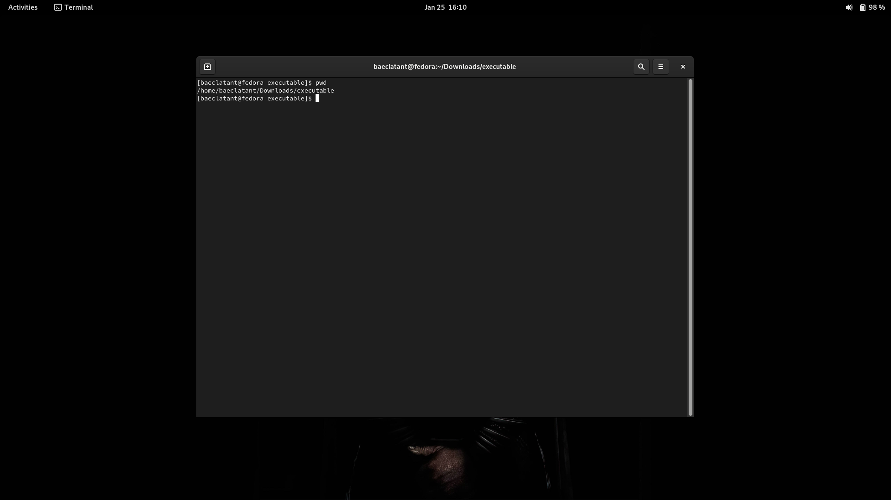
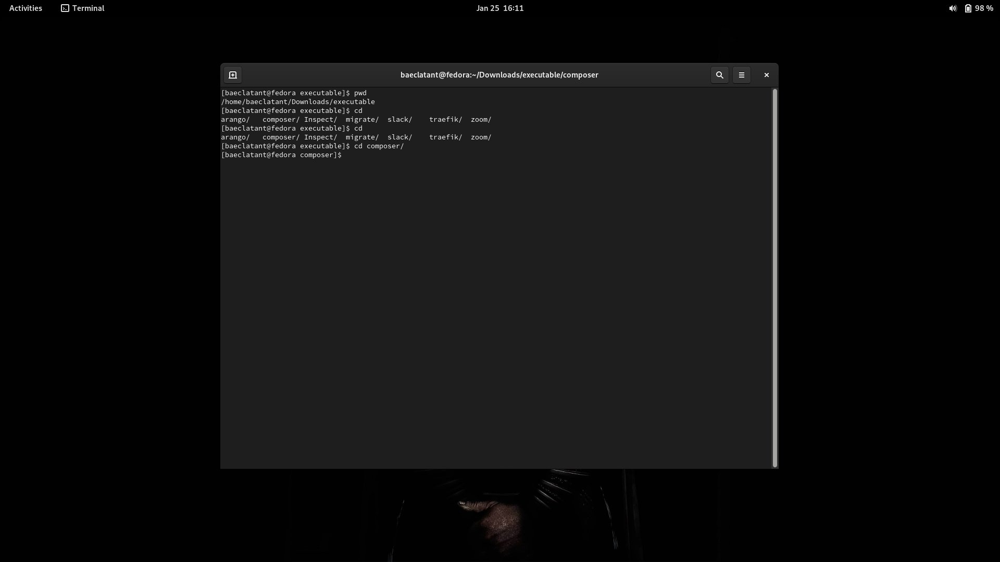
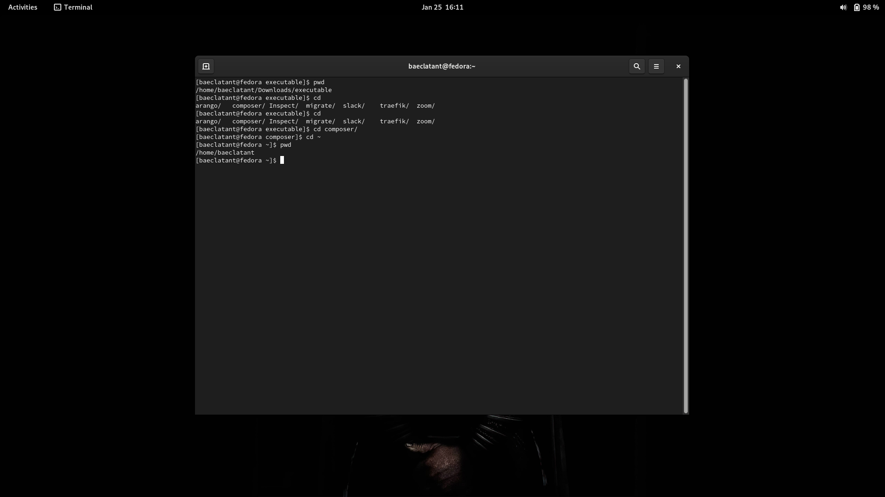
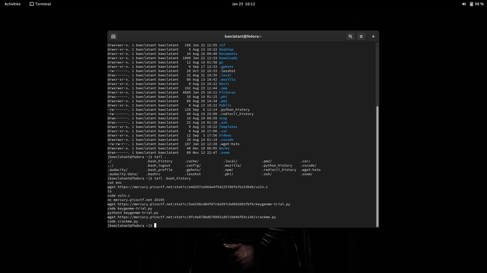
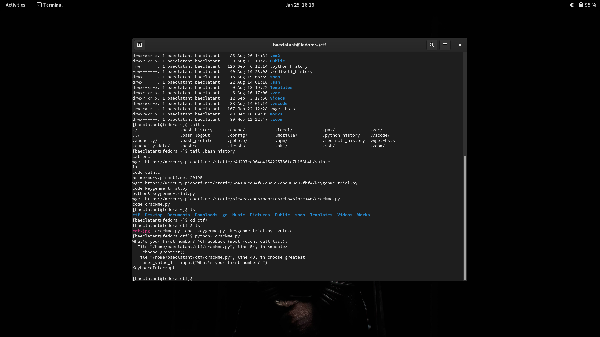

# Getting to Know

## CLI
Before diving into CLI, we might need to know what CLI is, or what CLI stands for.

CLI stands for Command Line Interface. This section will mostly talk about what CLI is. What can it do, what we can do with it, etc. Before we proceed to the next section. There are some prequisite or requirements for this to be an interactive long-long-long text. As mentioned in [previous section](./intro.md), at section Distro, we mentioned several distros that popular among the community. But from this point onwards, every example will be done in Fedora. Most of the time, there will no be any notable different if, we use Ubuntu for example. The only difference will be the package manager used. Simply put, Fedora uses `rpm`, while Ubuntu uses `apt`. But feel free to use any distro that suits you the most.

### Anatomy of CLI
So, we got our Distro OS ready. Now, lets head out to our terminal. Once we open the terminal, we will notice this box where we can type in anything in there. 

This is what people often call the REPL, Read, Evaluate, Print, Loop. The name itself is pretty self explanatory we might say. We can say that the terminal is like a program we make that can keep having input one at a time, endlessly, until, we, the user decide to close the terminal. Like what REPL stands for, this terminal can receive input, doing task, and print the output, and we can re-do that step again for everything we need. Not necessarily everything, but you got the point.

### Shells & Emu
Proceeds from the last section. The 1 million dollars question would be, how come the terminal do what it must do, based on our input? So, stepping back a few steps. The terminal is basically a shell, that continue to receive input and (sometimes) print the output. Most of the distros out there by default has bash built in. Some may use zsh (the same thing), or in cases like Windows, PowerShell.

While the Emulator, is the one that run the shell. We mentioned terminal a few times in previous section above. That is, the emulator. Whether it's Ubuntu Terminal, Fedora Terminal, or even iTerm (if we're using MacOS)

### Filesystem
The way bash works is that we will always be in a directory. Just like Windows Explore, or Mac Finder, you can navigate around between directories. We can also do this in bash with a few well known commands.

For example, let say we want to know where our position currently in bash. 

Simply type `pwd` to get the current working directory

Or `ls <path>` for listing all files and directories.

Another way to move to another directory is by using the `cd <path>`.

One thing to notice is that we mention path. Path is like saying the address of spesific file you are looking for. For example, by using `cd`, if we type in `cd /home/user`, is basically saying, `let's change directory to directory user under home`. In unix-like OS, `/` is the root directory. Of course, you can have multiple users accross the OS itself. Usually, every user will have their own home directory. Let say the current user is `fenezema`. In most casses, the home directory for user `fenezema` will be `/home/fenezema`.

Based on images above, you can see that before the `$` sign, there is this prompt. Usually, you can find your username and your full working directory there. But, in image below, in Fedora in this case, the full path will be available to see on top, in the menu bar of the terminal itself. Similarly, the same thing also applied if we're using MacOS, with exception the menu bar also only display the current working directory, not the full path of the working directory

### Commands & Arguments
We previously tried a few well known commands, like `pwd`, `cd`, `ls`. You will find youself using the well known commands so often that you won't have troubles remembering some it. But no one (I guess) have remembered every single possible command available. So, you can always looks for cheat sheet, or you can visit this [amazing page](https://linuxconfig.org/linux-commands-cheat-sheet) for some other commands you might find useful. 

While some commands are stand alone, some commands like `cd`, `ls` are mandatory (or optional for `ls`) to pass argument to it. Just like `cd` command, you need to pass argument for the command to actually works. In a simple analogy, if you want to move somewhere, you need to know your spesific destination in order for you to get there. The same thing is applied to `cd` command, where you need to pass path argument for it to actually works.

### Now with Flags
So what is flags now. Flags are the additional identifier, that actually might resulting in different results if passed to certain commands.

For example, `ls` has a lot of flags that you can use for.

As what it looks line on image above, `ls -l` will show all the data in current directory, complete with who owns what file, and the permissions. 

In most cases, commands usually have flag `--help` that will show what argument should be use, and what flags that available for use.

### Bash History!!
Notice that everytime we type in any command, if we want to re-use the command we typed in earlier, we can always "scroll it down" by traversing the history. The simplest way to do this is by clicking up arrow button in your keyboard for previous command or down arrow button for what comes next.

But if we need all the history listed, we can always type in `tail <path to history file>`. Here a thing to note. Not every OS use bash. So, it will affect on how things are named. For example, if we use pure bash, we might find the history file lying in the home directory named `.bash_history` (again, `.` before directories or files indicates that it is hidden). On contrary, zsh shell history named as `.zsh_history`. The easiest way to identify the shell history file is looking the `_history` postfix.

### Signals
Shell also receive and can process what we called as Signal. This is possibly the thing we do so often that we don't even realize that this process is called signal.

The one we possibly use so ofter is the `SIGINT`, which the `INT` stands for interrupt. This can be done by `ctrl + c` or `control + c` in MacOS. By default, almost all program handle `SIGINT` similar to one another, which is interrupt and stop the process. 

If we need, we can always type in `kill -l` which will list all possible signal our terminal support.